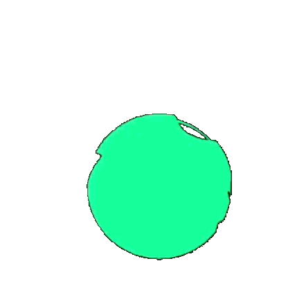

# Neon Triangle Morph

A neon green geometric morph loop converted from a user-provided video into portable motion assets.

## Files

| File | Use |
|---|---|
| `motion-transparent.webp` | Preferred transparent animated asset |
| `motion.gif` | Broad fallback |
| `motion-black.webp` | Black-background version, closest to original video |
| `motion-black.gif` | Black-background GIF fallback |
| `source.mp4` | Original source backup |
| `poster.png` | Static preview frame |
| `metadata.json` | Machine-readable metadata |

## HTML

```html
<picture>
  <source srcset="./motion-transparent.webp" type="image/webp" />
  
</picture>
```

## CSS

```css
.motion-asset {
  width: 96px;
  height: 96px;
  display: block;
  object-fit: contain;
  pointer-events: none;
  user-select: none;
}
```

## License

Source license is currently unknown; treat as demo/personal-use until rights are confirmed.
